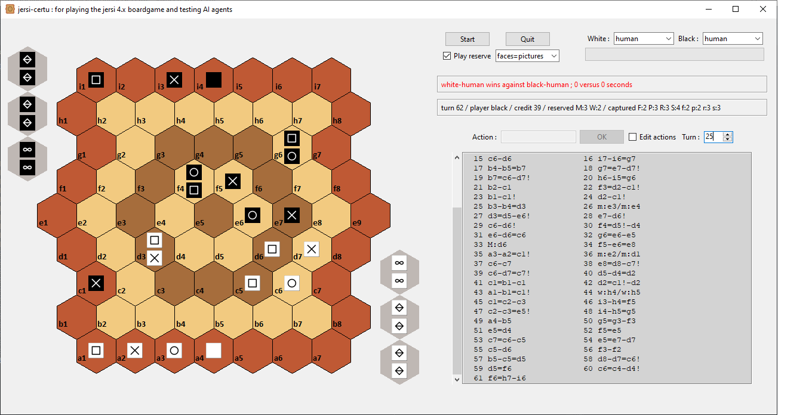
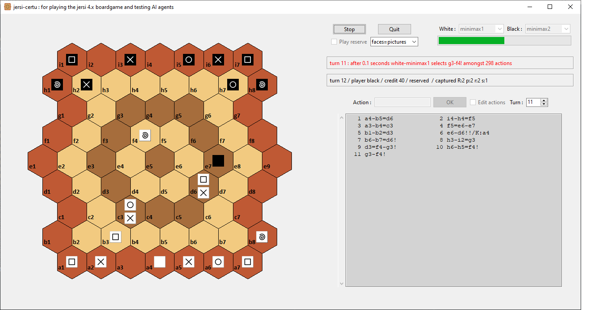
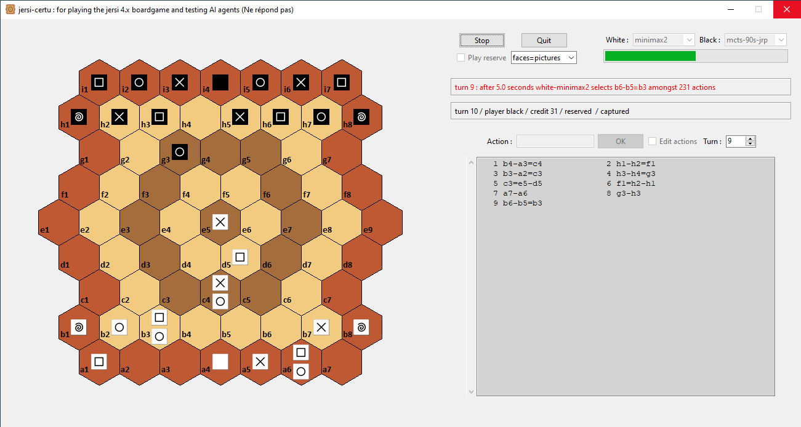

# jersi certu

The Python package *jersi_certu* provides a GUI and a rules engine for playing the [*jersi*](https://github.com/LucasBorboleta/jersi) board-game version 4 and also for testing AI agents. 

Below is an overview of the GUI interface, which retrieves the human chosen action thanks to a text field. Admittedly, the GUI is limited: fake progress bar, no thread dedicated to IA. The project has focused on the rules engine, the generator of all possible actions (for AI purpose) and the graphical display. 

The recorded actions can be edited and displayed back and forth ; even a game can be resumed by changing the players (e.g. IA instead human). So the GUI is usable for remote playing and for studying games.

 *jersi_certu* has been developed on Windows and then ported on Linux. For running it on your computer read the [**INSTALL**](./docs/INSTALL.md) instructions.

All combinations of players are possible: human/human, human/AI, AI/human and AI/AI. 

Current AI agents are : 

* **Minimax**: depth 2 is quick and good at tactics when the reserve is not played; otherwise depth 2 with cut-off to 400 possible actions is also quick but less good when the reserve is played (full rules).

* **MCTS** = Monte Carlo Tree Search. MCTS agents are parametrized in seconds or in iterations. The branching ratio of *jersi* is pretty high (often about 200 or even greater 1000 when drops are still possible), so MCTS, at least with a simple random roll-out policy, poorly performs. An experimental biased roll-out policy, named *jrp*, is provided, but yet it is weak.

* **Random** = purely random: useful for smoke testing of rules engine and AI agents;

The name of the package is coined after *certu* which means *expert* in lojban conlang.

If you intent to derive or to sell either a text, a product or a software from this work, then read the [**LICENSE**](./docs/LICENSE.txt) and the  [**COPYRIGHT**](./docs/COPYRIGHT.md)  documents.

More pictures (*minimax1* versus *minimax2* ; *minimax2*  versus *mcts-90s-jrp*):

