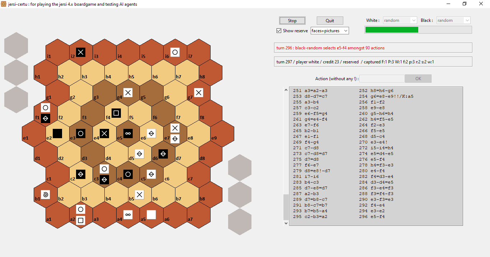

# jersi certu

The Python3 package **jersi_certu** provides a GUI and a rules engine for playing the JERSI boardgame version 4 and testing AI agents.

Below is an overview of the GUI interface, which gets the human chosen action using a text field. All combinations of players are possible: human/human, human/AI, AI/human and AI/AI. Current AI agents are: purely random (mainly used for tests) and MCTS (Monte-Carlo-Tree-Search). The branching ratio of JERSI is pretty high (often greater than 100), so MCTS, with random rollout policy, performs poorly.

If you intent to derive or to sell either a text, a product or a software from this work, then read the [**LICENSE**](./docs/LICENSE.txt) and the  [**COPYRIGHT**](./docs/COPYRIGHT.md)  documents.

<u></u>