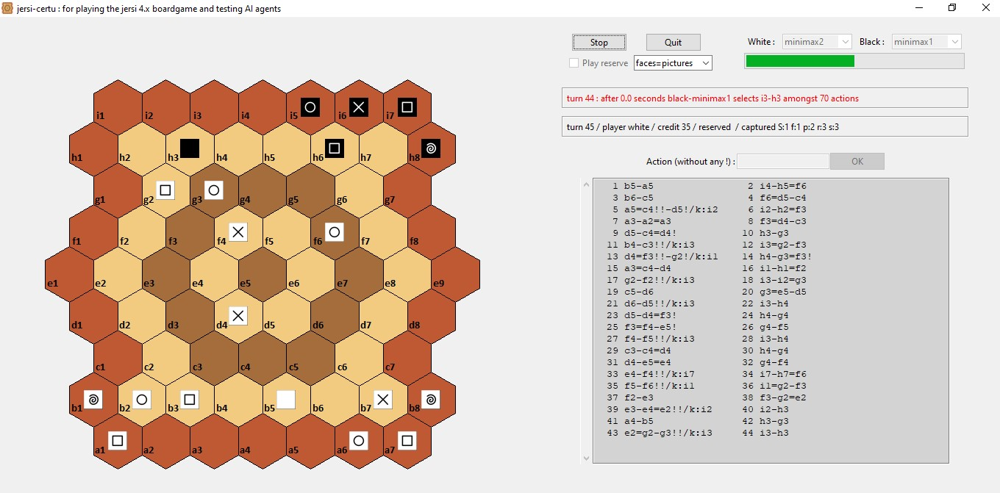

# jersi certu

The Python 3 package *jersi_certu* provides a GUI and a rules engine for playing the *jersi* board-game version 4 and also for testing AI agents. 

Below is an overview of the GUI interface, which retrieves the human chosen action thanks to a text field. It is simple and straightforward. The project has focused on the rules engine, the generator of all possible actions (for AI purpose) and the graphical display. Minimal time was spent on graphical input or on the progress bar.

All combinations of players are possible: human/human, human/AI, AI/human and AI/AI. Current AI agents are: purely random (usefull for smoke tests and as challengers for sophisticated AI agents) and based on Monte Carlo Tree Search (MCTS). MCTS agents are parametrized in seconds or in iterations. The branching ratio of *jersi* is pretty high (often greater than 100 or even greater 1000 when drops are still possible), so MCTS, at least with a simple random roll-out policy, poorly performs. An experimental biased roll-out policy, nammed *jrp*, is provided, but yet it is weak. On my computer having 8 Go of RAM, the agent MCTS-1ki, which runs 1000 rounds, failed in memory error: this exemplifies the size of the search tree.

The name of the package is coined after *certu* which means *expert* in lojban conlang.

If you intent to derive or to sell either a text, a product or a software from this work, then read the [**LICENSE**](./docs/LICENSE.txt) and the  [**COPYRIGHT**](./docs/COPYRIGHT.md)  documents.

